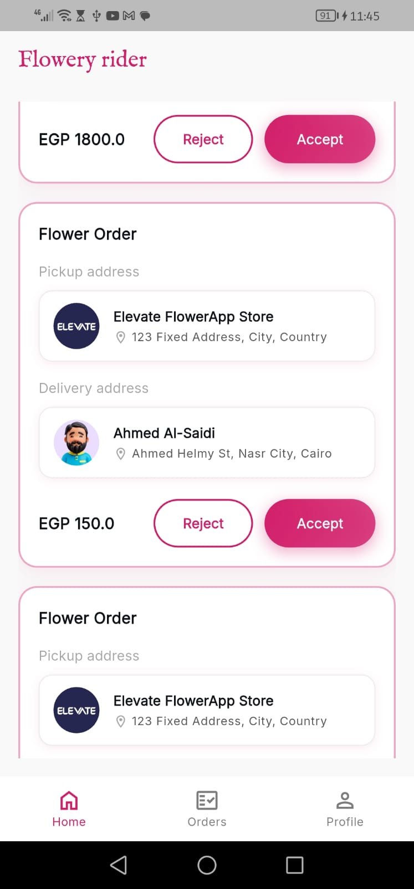
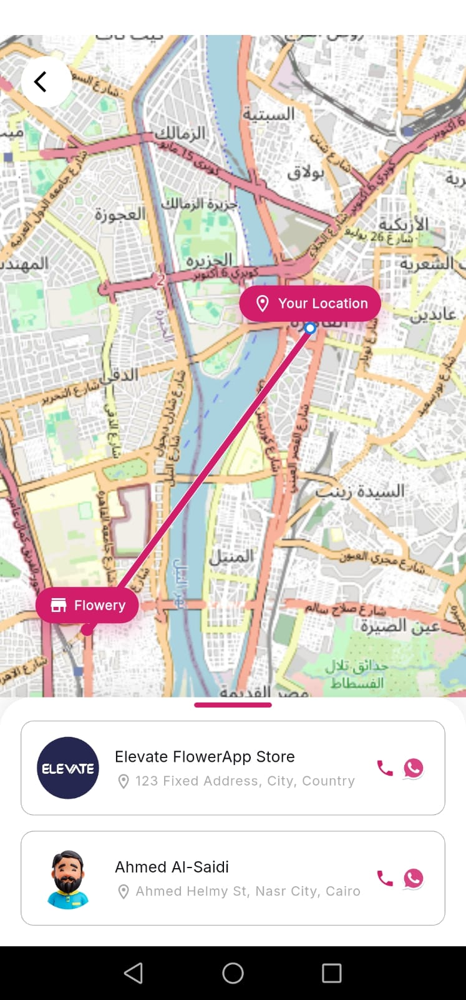
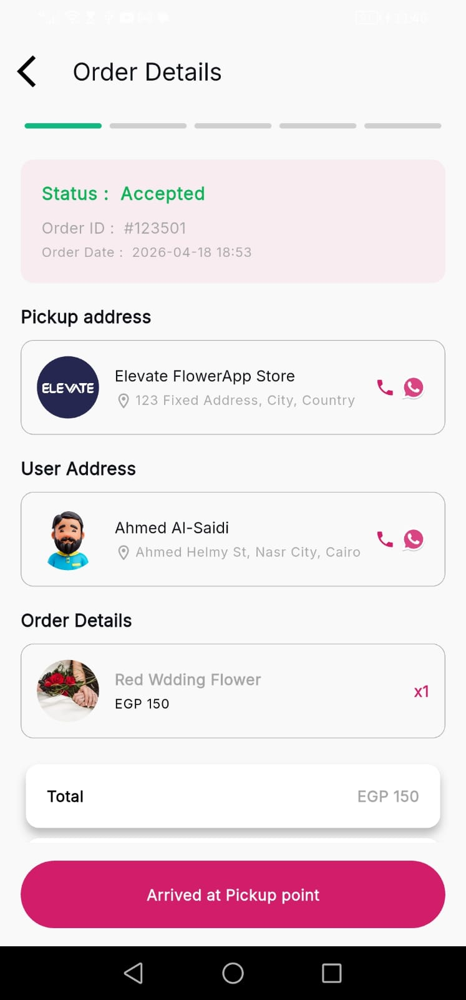
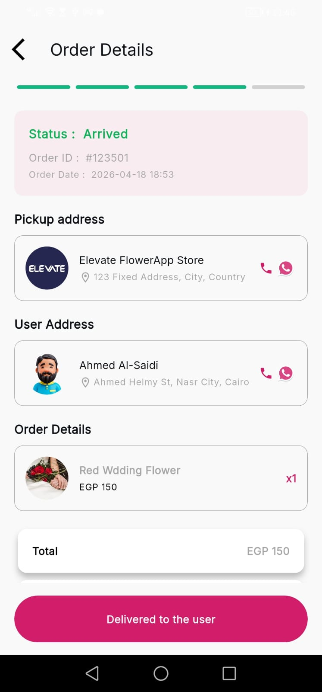
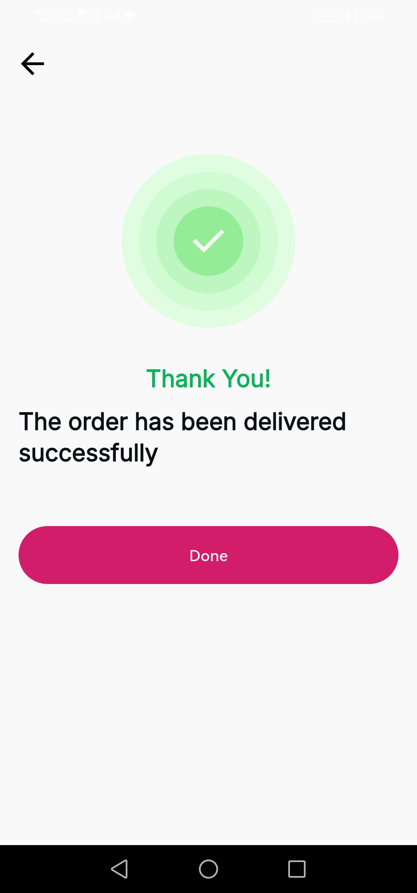

# Tracking App

[](https://flutter.dev/) [](https://dart.dev/) [](https://firebase.google.com/)

## Project Overview

Tracking App is a driver-facing mobile application built with Flutter for delivery professionals. It helps drivers manage active orders, track routes on a live map, update delivery statuses, and stay connected through push notifications.

## Features

- Order list and delivery assignment management
- Real-time location tracking with `flutter_map` and `latlong2`
- Route visualization and destination guidance
- Delivery status updates and order progress tracking
- Firebase Firestore integration for live order data
- Push notifications via Firebase Messaging
- Secure local storage for driver preferences and session data
- Multi-language support and polished UI flows

## Screenshots

| Home | Map | Update Order State |
|------|-----|--------------------|
|  |  |  |

| Deliver to User | Success |
|-----------------|---------|
|  |  |

## Tech Stack

- Flutter
- Dart
- `flutter_bloc` / Cubit
- `GetIt` / injectable
- `GoRouter`
- Firebase Firestore
- `flutter_map` / `latlong2`
- `easy_localization`
- `retrofit`, `dio`

## Architecture

The app follows a Clean Architecture approach with three main layers:

- `data` — repository and external data sources
- `domain` — business logic, entities, and use cases
- `presentation` — UI, Cubits, pages, and widgets

State management uses the Cubit pattern with clear intents and side effects. This keeps presentation logic decoupled from business rules and makes the app easier to test and maintain.

## Getting Started

### Prerequisites

- Flutter SDK installed (compatible with Dart 3.10+)
- Android Studio, Xcode, or suitable mobile device tooling
- Firebase project with Firestore and Messaging enabled

### Clone the repository

```bash
git clone https://github.com/your-org/tracking-app.git
cd tracking-app
```

### Install dependencies

```bash
flutter pub get
```

### Run the app

```bash
flutter run
```

## Project Structure

```text
lib/
  main.dart
  config/
  core/
  features/
assets/
  icons/
  images/
  lotties/
test/
android/
ios/
```

## Environment Setup

1. Create a Firebase project.
2. Enable Firestore and Firebase Cloud Messaging.
3. Download Firebase config files:
   - `android/app/google-services.json`
   - `ios/Runner/GoogleService-Info.plist`
4. Add any API keys or environment constants in the appropriate config files.
5. Ensure Firebase initialization is configured in `lib/main.dart`.

> Note: Keep Firebase credentials secure and do not commit them to source control.

## Notes

- Use `flutter pub run build_runner build --delete-conflicting-outputs` when updating generated code.
- Adjust route and environment config as needed for staging or production builds.
